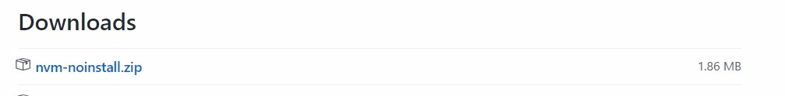
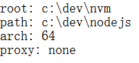
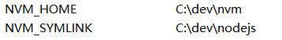
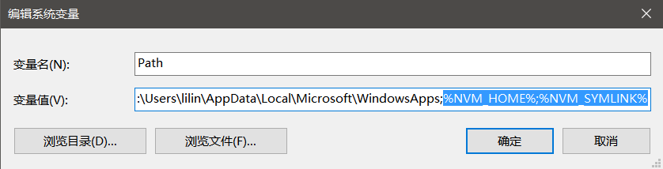
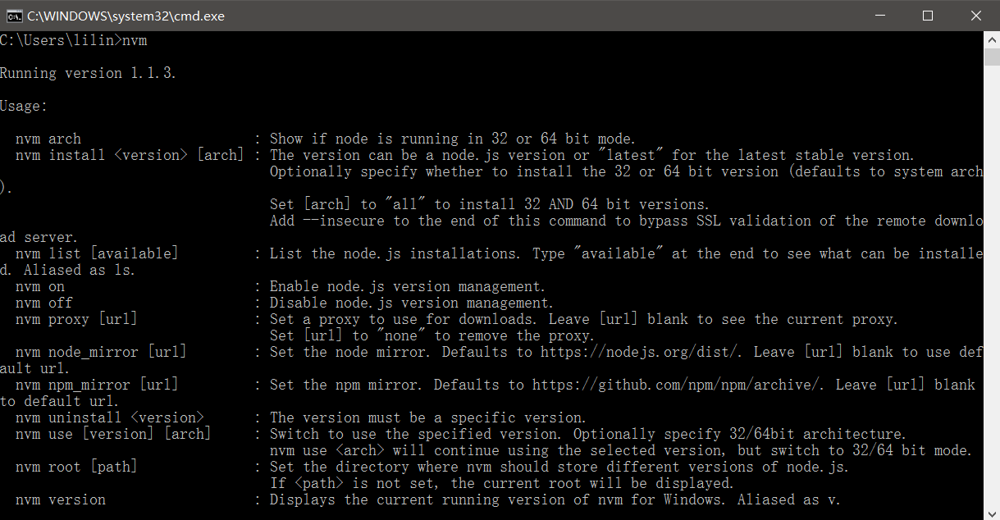
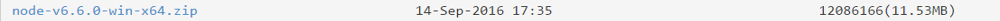
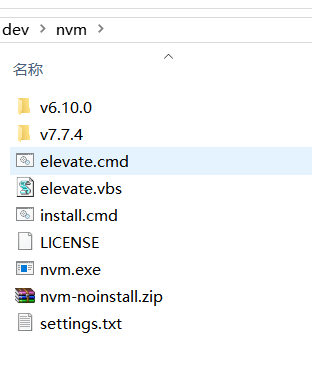

@(node.js)[javascript, node.js, 服务器]

# Node.js-01-安装配置

### node.js多版本安装、配置
**需要将电脑中已经安装的node卸载后在进行一下步骤。**
1. 下载：github 搜索 nvm，找到coreybutler/nvm-windows => releases => 下载非压缩版(nvm-noinstall.zip)
[下载地址](https://github.com/coreybutler/nvm-windows)

2. 安装配置
	1. 在c盘根目录新建dev文件夹（这里没有固定要求，任意你想安装的路径以及文件夹名称都可以）
	2. 在dev文件夹内新建 **nodejs** 和 **nvm** 两个文件夹，将下载下来的压缩包解压至 **nvm** 文件夹内。
	3. 以管理员身份运行 **install.cmd** 文件，出现命令行窗口回车即可。
	4. 在弹出的文本编辑器中配置 **root** 和 **path**路径，具体路径就是第二步中新建的 **nvm** 和 **nodejs** 文件夹的绝对路径。配置完成后保存并关闭。
	5. 检查 **nvm** 文件夹内是否有 **settings.txt**（这就是刚才配置的root 和 path的编辑器），若没有则系统可能自动保存在了c盘根目录，找到并剪切至当前文件夹。（找不到也可以自己新建一个 settings.txt 并按上图内容进行编辑，并保存至 **nvm** 文件夹内）
	6. 配置环境变量
		1. win10系统下，我的电脑 => 右键属性 => 高级系统设置 => 环境变量 => 设置变量指向的路径，将一下两个系统变量按图进行设置（具体路径以第二步中文件夹路径为准） 
		2. 在PATH变量尾部，添加下图选中的文本（就是刚才配置的变量）。
	7.	此时 nvm 安装完毕，打开命令行（win + r => cmd）输入：`nvm`，检查 nvm是否成功安装，安装成功则会出现一下信息。
	8.	此时可以进行nodejs的安装。通过命令`nvm install <version> [arch]`来安装。version 可以使用具体版本号或 `latest` ，arch 表示系统架构 32/64 bit mode，不写则默认自动匹配。如：`nvm install latest`，我的电脑是64位的系统，则会自动为我安装64位的最新版nodejs。
	9.	安装了多个版本的nodejs后，需要切换node版本，直接使用`nvm use [version] [arch]`即可。
	10.	其他具体指令使用`nvm`可以自行查看。

3. nodejs 镜像[下载地址](https://npm.taobao.org/mirrors/node)
	- 由于服务器在国外，使用nvm下载nodejs速度较慢。可在淘宝镜像中下载所需版本的压缩包，解压至nvm文件夹中即可。

4. npm配置registry路径及使用rnm管理npm包下载地址
	- npm set registry http://xxxxxxx
	- C:\Users\用户名 该路径下存在一个 .npmrc 文件，其中保存的就是npm的registry路径，上方法设置的就是该文件的内容，手动修改也可以
