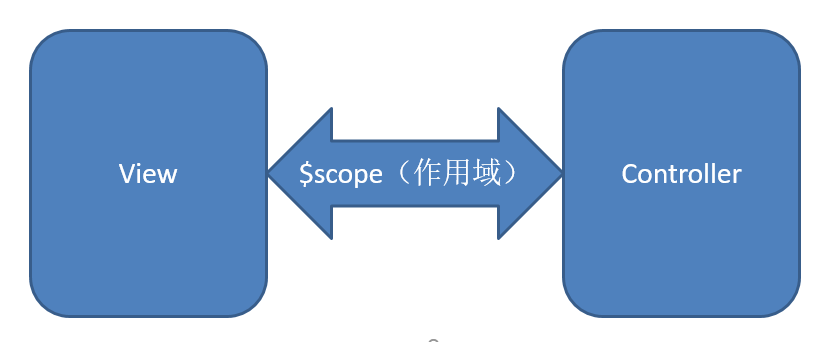

@(framework)[angular]

# Angular-02-基本原理及指令


### Angular VS jQuery

- jQuery:库
    + 封装了一些常用的方法，我们主动调用这些方法
- Angular:框架
    + 框架提供了一些结构或者模式，
    + 我们按照框架提供的规则去写代码
    + 然后由框架自己去执行相应的操作

 - 思想上:
    jQuery: 提高了dom操作的开发效率。
    Angular: 不提倡dom操作，几乎没有dom操作(底层还是操作的dom)
        + angular中操作dom `angular.element()` ,叫做jqLite
### angular.element
- 轻量级的jQuery,
*注意：在获取dom对象时传入的参数是一个原生dom对象*


Angular开发流程

1.在HTML代码中引入angular.js这个文件
2.在HTML代码上加上ng-app指令，告诉angular来管理我们的代码，这个指令只能使用一次
3.在JS代码中通过`angular.module('模块名',[])`创建一个模块，然后在HTML中的ng-app指令指定一下模块名'ng-app="模块名"'
4. 在JS代码中创建控制器`xxx.controller('控制器的名字',function(){})`,在HTML代码中通过ng-controller指令由我们当前的控制器来管理数据模型`ng-controller="控制器的名字"`
5. 建模（根据页面原型抽象出数据模型）, 最终得到视图模型(ViewModel)
6. 通过`$scope`来暴露页面上所需要使用的一些数据
7. 在HTML代码中通过`ng-model/ng-click/｛｛｝｝` 将刚刚暴露的数据绑定到页面上去
8. 在JS中写一些具体业务相关的代码

MVC
- MVC是一种设计思想,它是约定了程序的结构应该是怎么。
- 每一个组成原件都会有一个明确的职责。
- 提高代码的结构和可维护性(代码的执行效率肯定是不会提高的，10行代码，会分到10个不同的方法。);

### $scope

- 视图和控制器之间的数据桥梁
- 用于在视图和控制器之间传递数据
- 用来暴露数据模型（数据，行为）



### ViewModel

- $scope 实际上就是MVVM中所谓的VM（视图模型）
- 正是因为$scope在Angular中大量使用甚至盖过了C（控制器）的概念，所以很多人（包括我）把Angular称之为MVVM框架
- 这一点倒是无所谓，具体看怎么用罢了


## 模块

### 模块的创建
> 通过`anuglar.module()`方法来创建模块.

*注意,如果传入两个参数就是去创建模块，如果只传入第一个参数，就会变成获取模块。*

### 模块的划分式

1. 根据项目中具体的功能去划分模块

2. 根据具体的文件功能的类型去划分模块

## 控制器的创建方式

### 传统的方式创建控制器(不推荐使用这种方式)

```javascript
    // 通过全局函数来创建控制器
        // angular会把我们创建的全局函数作为控制器使用
        function demoController($scope){
            $scope.name='小明';
        }
```

### 面向对象的方式创建控制器

```html
    <div ng-controller="demoController as obj ">
        ｛｛obj.name｝｝
        ｛｛age｝｝
    </div>
    <!-- 1.引入angular.js文件 -->
    <script src="node_modules/angular/angular.js"></script>
    <script>
        // 3.创建模块
        var app =angular.module('myApp',[]);

        // 4.创建控制器
        app.controller('demoController',function($scope){
            // 可以当作构造函数来使用
            this.name="小明";
            $scope.age=12;
        })
    </script>
```

### 安全的创建控制器的方式
- 原因：angular在控制器的回调函数中是通过参数名来传递参数的。代码压缩后，形参`$scope`会被压缩，压缩后angular就无法识别了。
- 通过将第二个参数改为数据组：数据的最后一个参数还是原来的fucntion,数据前的参数是我们想要anuglar传递的参数的字符串形式，fucntion里的参数需要与数组前面的元素一对应。
`app.controller('demoController',['$scope','$log',function($scope,$log){}])`


### 依赖注入的原理
- 核心是toString()
- 获取函数形参的方式

```
function test(callback){
   var name="小明";
   //console.log(callback.toString());
   var func=callback.toString();

   var arr = func.split(/\(|\)/);
   var arg = arr[1];
   console.log(arg);

   callback(name);

}


//调用一下
test(function(name){
   console.log(name);
})
```


### 指令

- 在 AngularJS 中将前缀为 ng- 这种属性称之为指令，其作用就是为 DOM 元素调用方法、定义行为绑定数据等
- 简单说：当一个 Angular 应用启动，Angular 就会遍历 DOM 树来解析 HTML，根据指令不同，完成不同操作

- `ng-bind`
    + 用来解决表达式闪烁问题
    + `<p ng-bind="数据模型"></p>`
    *注意：只能够在双标签中使用ng-bind指令*

- `ng-cloak`
    + 用来解决表达式闪烁问题，cloak斗篷，在js加载完成之将这个类名取消。
    + `<p class="ng-cloak">｛｛name｝｝</p>`
    + `.ng-cloak{ display:none; }`
    + 利用angular在加载会移除页面上所以名为ng-cloak的样式名的特性。

- ngSanitize模块
`npm install angular-sanitize`
    + 使用的是ng-bind-html指令来渲染数据模型。

		```
		<body ng-app="myApp">
		    
		
		    <div ng-controller="demoController">
		        ｛｛name｝｝
		        <p ng-bind-html="name"></p>
		    </div>
		    <script src="node_modules/angular/angular.js"></script>
		    <script src="node_modules/angular-sanitize/angular-sanitize.js"></script>
		    <script>
		        //1 .创建模块 
		    var app = angular.module('myApp',['ngSanitize']);
		    // 2.创建控制器
		    app.controller('demoController',['$scope',function($scope){
		        $scope.name='<div>123</div>'
		    }]);
		    </script>
		</body>
		```

- `ng-repeat`
    + 可以用来循环输出数组
    + 写在哪个元素上就是循环哪个元素。
    + 语法：类似于forin 循环
        > `<div ng-repeat="item in data ">｛｛item｝｝</div>`
    + `track by $index` 解决数组中数据有重复的问题，若有过滤器，须将`track by $index`放在最后
        + `<li ng-repeat="item in tesData track by $index"></li>`
    + `ng-repeat="(k , v) in data"` 可以得到键和值
		    
		```
		<body ng-app="myApp">
		      <div ng-controller="demoController">
		          <ul>
		          <!-- ng-repeat:语法类似于forin循环
		              循环输出所在标签 -->
		              <li ng-repeat="item in data ">
		                  ｛｛item.name｝｝,｛｛item.age｝｝
		              </li>
		          </ul>
		          <div>
		              <div ng-repeat="item in data" >
		                  ｛｛item.name｝｝,｛｛item.age｝｝
		              </div>
		          </div>
		          <ul>
		              <li ng-repeat="item in testData track by $index">
		                  ｛｛item｝｝
		              </li>
		          </ul>
		          <h1>渲染key,value数据</h1>
		          <ul>
		              <li ng-repeat="item in obj">
		                  ｛｛item.name｝｝，｛｛item.age｝｝
		              </li>
		          </ul>
		      </div>
		   <script src="node_modules/angular/angular.js"></script>
		   <script>
		       // 1.创建模块
		       var app = angular.module('myApp',[]);
		
		       // 2.创建控制器
		       app.controller('demoController',['$scope',function($scope){
		           $scope.data=[
		              {name:'小明',age:23},
		              {name:'小月',age:20},
		              {name:'小白',age:21},
		              {name:'小黑',age:22},
		              {name:'小红',age:18},
		           ];
		           $scope.testData=[1,2,3,4,5,1];
		           $scope.obj={
		              xm:{name:'小明',age:23},
		              xy:{name:'小月',age:20},
		              xb:{name:'小白',age:23},
		              xh:{name:'小黑',age:23},
		              }
		       }])
		   </script>
		</body>
		```
    + 还可以用来渲染key,value对
    + `ng-repeat` 在遍历里会暴露一些数据模型,
	    - `$index`:循环遍历中的第几条数据 
        - `$even`:提供了一个布尔值，当为true时表示当前数据是第偶数条数据,从索引0开始计算
        - `$odd`:提供了一个布尔值，当为true时表示当前数据是第奇数条数据,从索引0开始计算
        - `$first,$last ,$middle`

		```
		<tr  ng-repeat="(k,v) in data" class="｛｛$even?'orange':'blue'｝｝">
						<td>｛｛v.name｝｝</td>
						<td>｛｛v.age｝｝</td>
						<td>｛｛v.gender｝｝</td>
						<td>｛｛v.grade｝｝</td>
		</tr>
		```


- `ng-class`:
    + 从多种样式中选择一个样式
        - 语法：类似于从一个key,value对象中获取其中一个属性的值
        - `ng-class="{'A':'red','B':'blue','C':'green'}['A']"`
    + 从多种样式中选择多个
        - 语法：也是写一个key,value对象，这里的key是我们提供的类样式名，value是一个布尔值，为true时对应的key会被作为样式名加入到class中
        - `ng-class="{'red':false,'fontColor':true,'green':true}"`

- `ng-hide`/`ng-show`
	- `ng-hide`：需要一个布尔值：当为true时为隐藏当前元素
	- `ng-show`: 需要一个布尔值：当为true时为显示当前元素

- `ng-if`:需要一个布尔值：当为true时为显示当前元素,为false时是删除当前元素

- `ng-switch`:与`ng-switch-when`同用，类似与js中的switch case

	```html
	    <div ng-switch="name">
	            <div ng-switch-when="小明">我是小明</div>
	            <div ng-switch-when="小红">我是小红</div>
	            <div ng-switch-when="小月">我是小月</div>
	    </div>
	```

### 其他常用指令

- `ng-checked`：
  + 单选/复选是否选中,是单向数据绑定
- `ng-selected`：
  + 是否选中
- `ng-disabled`：
  + 是否禁用
- `ng-readonly`：
  + 是否只读

### 常用事件指令

不同于以上的功能性指令，Angular还定义了一些用于和事件绑定的指令：

- `ng-blur`：失去焦点
- `ng-focus`：获得焦点
- `ng-change`：改变事件
- `ng-copy`：复制事件
- `ng-click`： ng-click="add()"
- `ng-dblclick`：双击事件
- `ng-submit`： 表单提交事件

### 指令的标准使用方式
data-xxx,在使用angular指令时，只需要在原先的指令前加上data-前缀。
x-
