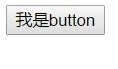
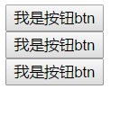
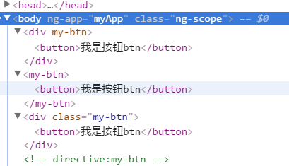
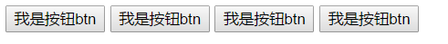
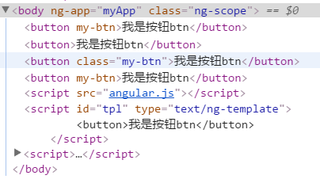
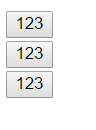
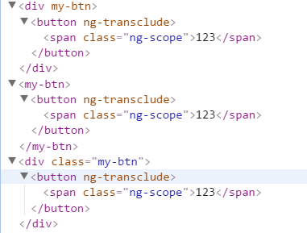
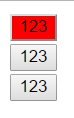
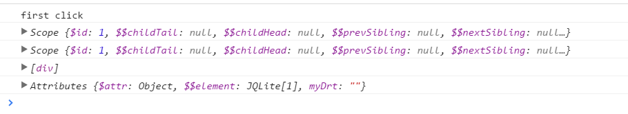

@(framework)[angular]

# Angular-03-进阶(自定义指令、过滤器、自定义服务及路由)

### 自定义指令简单介绍及使用
- 自定义指令无外乎增强了HTML,提供了额外的功能。
- 内部指令基本能满足我们的需求。
- 少数情况下我们有一些特殊的需要，可以通过自定义指令的方式实现：

- 通过 模块对象的`directive`方法创建
    + 有两个参数，第一个参数，是指令的名字：必须是**驼峰命名法**命名;第二个参数和控制器的第二个参数一样,在第二个参数的function里直接返回的一个obj对象
    + 使用时：需要将指令的名字转成小写，并以-分割原先在大小写字母
### 自定义指令中回函数里返回的对象的属性
- `template`:需要一个字符串，最终这个字符串值被被添加到自定义指令所在标签的innerHTML位置

	<body ng-app='myApp'>
		

		
	</body>

	- 图示：

- `templateUrl`:需要一个字符串，这个字符串是一个文本文件的路径,anuglar最终会异步请求这个文件，把拿到的内容插入到自定义指令所在的标签的innerHTML位置,
该字符串也可以是script标签的id值，把script标签中的内容当作模板字符串来使用
注意：script的type属性需要为`text/ng-template`

	

	<body ng-app='myApp'>
		

		
		
	</body>

	- 图示：

- `restrict`: 将指定形式的标签的innerHTML设置为模版内的内容
	- 也是需要一个字符，可以是A,E,C,M (ECMA)这4个字符中任何一个，也可以任意的组合。
	- A:attribute以属性的形式使用
	- E:element以自定义标签的形式使用
	- C:class表示以类样式名的形式使用
	- M:以注释的形式使用

	<body ng-app='myApp'>
		

		<my-btn></my-btn>
		

		<!-- directive:my-btn -->
		
		
	</body>

	
	- 注释形式的内容替换后由于是注释，所以无法显示
		图示： 

- `replace`: 需要一个布尔值，为true,会将自定义指令所在的标签**替换**为模板字符串。 放在新标签并替换原标签及内容。在设置`replace`为true时，必须保证模板的根元素要唯一。  `
...
`   ~~`

`~~

	angular.module('myApp',[])
	.directive('myBtn',[function () {
		var obj = {
			// templateUrl:'./view.html',//使用ajax异步请求文件，并将内容插入到指定标签的innerHTML位置。
			templateUrl:'tpl',//指向scriptID
			restrict:'ECMA',//E:element C:class M:注释 A:attribute  推荐以属性形式
			replace:true , //替换容器标签,而非设置innerHTML
		};
		return obj;
	}])

	图示：   

- `transclude` : 将模板中的字符串插入指定标签，且不改变原标签内的内容，忽略模板中带有`ng-transclude`属性的标签内部的内容。可以插入各种标签、文本、图片等
	- 转置，是需要一个布尔值，为true时会把自定义指令所在标签的innerHTML值添加到模板字符串中，需要与`ng-transclude`指令配合使用，`ng-transclude`指令需要将值插入到哪个元素的innerHTML位置.不能与replace指令同用，使用replace后原标签已经不存在了，故不可用。

	

	<body ng-app='myApp'>
	
	
123

	<my-btn>123</my-btn>
	
123

	
	
	
	
	
	</body>

	图示：   

- `scope` scope主要是用于在指定标签内可以使用**插值**的方法插入文本，且**只能插入文本**，此时取值必须为对象{}。 同时还可以用于设置指令的作用域. 它的取值可以是 false( 默认 ), true, 和 对象.
	- `false` 默认在当前ng作用域
	- `true`  可以看作在该标签处设置了一个新的 controller ，所有ng对象($scope)处在这个新的controller的ng作用域内，继承自该标签的所在的那个ng作用域。
	- `{}` 创建一个新的、独立的ng作用域，不从任何地方继承。可以获取到自定义指令所在标签的属性值。
    {
        属性名:'@test', 属性值需要以@开头,@后面是自定义指令所在标签的属性名，最终在模板字符串中通过表达式可以使用scope的属性名可以直接输出
        test:'@'// 是简写方式
    }

	

	<body ng-app='myApp'>
		
123

		<my-btn>123</my-btn>
		
123

		
		
		
	</body>

图示： 

- link:指向一个function，这个function有三个参数：
    + scope: 类似于控制器中的$scope,也可以暴露一些值。
    + element:这是一个jqLite对象，是自定义指令所在标签的jqLite对象
    + attributes:是自定义指令所在标签的所有属性的集合.

	<body ng-app='myApp'>
		
我是原来的div

		
	</body>

## 过滤器(filter)

### 格式化数据的过滤器
- currency 将数字转成货币的形式显示
	- 语法在数据模型后面加上 |currency  参数，通过冒号:的方式传递
    - `
｛｛money | currency :'￥' ｝｝
`

- date 将整数形式的日期转换为用户能够识别的形式;
- 语法在数据模型后面加上 | date 
        参数，通过冒号:的方式传递
    `
｛｛money | date:'yyyy-MM-dd hh:mm:ss' ｝｝
`

	<body ng-app='myApp' ng-controller='myCtrl'>
		
｛｛num  | currency:'￥' ｝｝

		
｛｛date | date : 'yyyy-MM-dd hh:mm:ss'｝｝

		
	</body>

> ￥123
> 2016-6-6 11:10:32

- limitTo 是控制字符串显示的长度
    + 有两个参数，第一个表示需要显示长度，第二个表示从哪个索引开始显示

- orderBy,让显示的数据按照一定的顺序显示
	- 需要一个字符串作为参数：这个字符就是数组中元素的一个属性名,默认是按升序排列的，如果给这个字符前加上一个`-`号表示降序排列.

- json

- 在js中使用过滤器的方式

    		// $filter其实是个方法
           // 第一个参数:就是过滤器的名字$filter('过滤器名') 
           // 会返回一个方法
           //               + 至少有一个参数(就是使用到的数据)$filter('过滤器名')(数据，参数)
           //               + 其他的参数依次是过滤器所使用到的参数
           angular.module('myApp',[]).controller('myCtrl',['$scope','$filter',function($scope,$filter){
			   var tmp = $filter('date')($scope.myDate,'yyyy年MM月-dd日 HH:mm:ss')
	           $scope.tmp=tmp;
		}])
        

- 1234588910120
- 1234567891011

### 过滤数据的过滤器
- filter
- 一般是与ng-repeat指令共同使用
- 参数：可以是一个普通类型-angular会对这样的参数进行全局匹配; `ng-repeat="item in data | filter: true  track by $index"`
        也可以是一个object对象-angular就会根据对象中的属性及属性值去数据中的每一个元素中寻找相应的属性，当前属性值相等的时候数据就会被显示。`ng-repeat="item in data | filter: {name:'lisi'} track by $index"`

### $location监视页面锚点的变化
- `console.log(location.hash)` 会显示出当前页面地址的锚点值  如`#/completed`
- angular中`$location.url()`方法可以获取到页面的锚点值，但是不包含#号 如`/completed`
- 是通过`$watch`动态的监视$location.url()方法的返回值,再做相应的处理.
- 要把`$location`赋值给`$scope`的一个属性(`$scope.loaction=$location`)

### 自定义服务
- 对于一些许多模块都需要使用的一些通用方法，以通过以服务的方式来注入。类似于`$scope` `$location` 等就是angular自带的服务
- 通过模块对象的service方法创建，参数类似与controller的参数
- service中的function是当作一个构造函数来使用的,

		var app = angular.module('todos.service',[]);
			app.service('todos',[function () {//相当于是一个构造函数，使用时相当于通过这个函数new了一个对象
				this.name = 'xiaoming';
				//要使用name数据模型时，在controller中注入todos这个服务后，即可通过todos.name来访问
				//具体示例如上图
		}]);

- 直接在控制器的注入service的名字，它就是这个构造函数的实例对象

示例：
	
	//创建controller.js
	(function (angular) {
		var app = angular.module('myApp.controller',[]);
		app.controller('myCtrl',['$scope','service',function ($scope,service) {
			$scope.name = 'lennie';
		}]);
	})(angular);
	
	
	
	//创建app.js,并将controller注入进来
	(function (angular) {
		var app = angular.module('myApp',['myApp.controller','myApp.service']);
	})(angular);
	
	
	
	//创建自定义服务 
	(function (angular) {
		var app = angular.module('myApp.service',[]);
		app.service('service',[function () {//相当于是一个构造函数，使用时相当于通过这个函数new了一个对象
			this.name = 'xiaoming';
		}]);
	})(angular);
	
	
	
	<!-- html页面将js文件全部引入即可，其他部分不变（app.js与controller.js的引入顺序都可） -->
	<body ng-app='myApp' ng-controller = 'myCtrl'>
		<input type="text" ng-model='name'>
		｛｛name｝｝
		console.log(todos);
		
		
		
		
	</body>
	

### 抽象服务

## 路由

### 路由介绍

### 路由初步使用（ngRoute）
- ` npm install angular-route`
- 通过模块的`config`方法来创建路由规则
- 有一个参数：类似于controller的第二个参数
- 有一个需要注入的参数:`$routeProvider`
    + 这个参数是用来设置具体的规则的
    + `$routeProvier.when()`
        - when第一个参数是当前url中锚点的值
        - when第二个参数是object对象：template属性
            - 最终angular会把`template`对应的模板字符串插入到页面拥有`ng-view`指令的标签的innerHTML位置.
            - `controller`属性，指向一个控制器,最终控制器的暴露的数据能够在`template`指定的字符串的使用。
            - **注意，此处的`controller`只可供此处使用，不得在页面中插入同名controller，否则报错**

**angular 1.6.x开始，路由地址由`#/xxx`变为`#!/xxx`，所有使用锚点指向某地址时，需添加 `!` ，但是angular的`$location.url()`获取的锚点仍为`/xxx`的形式，`$provider.when('/xxx',{})`的锚点指向地址也是1`/xxx`的形式，保持不变**
        

### 路由参数
- 类似于过滤器中使用参数的形式
- `when('/students/:name')`,最终在控制器中可以通过$routeParams拿到这个参数，
    + `$routeParams`就是一个拥有`name`属性的对象.
    + 可以在参数后加个问号表示当前参数是可选。
        ——- `when('/students/:name?')`
    + 路由参数是可以使用多个，也是通过`$routeParmas`来获取`when('/:students/:name')`

- otherwise
- 用于匹配前面所有when方法没有匹配到规则。
    +指定了一个对象作为参数，这个对象有个属性:redirectTo:'/students/'

### 路由更新 $route
- 用于更新路由参数，$route.updateParams({})
    + 这个参数里的object对象是要求拥有  一个路由参数名作为属性
- 如果要改变整个锚点值，需要使用$location.url('/haha/')

##### 路由demo

	<body ng-app='myApp'>
	    <a href="#!/student">abc</a>
	    

	    <!-- 将路由中模板中的内容插入到ng-view所在的标签中 -->
	    
	    
	    
	</body>

## todomvc综合案例

### todomvc 简单介绍
- github 搜索 todomvc template

### todomvc 功能分析

1. 显示数据列表
2. 添加任务
3. 删除任务
    - 使用了数组的splice
4. 修改任务
- 只是改变页面是否可以编辑的一个状态
5. 切换是任务是否完成的状态
6. 批量的切换任务是否完成的状态
    - 使用了ng-change事件
7. 清除已完成任务
- 尽量不要在循环中添加或删除数组元素。
7.1 控制清除已完成任务按钮的显示与否 
8. 显示未完成的任务数
- 是给ng-bind指定一个方法,方法最终会返回一个具体的值,
- ng-bind 会把这个值渲染到页面。
9. 切换不同状态任务的显示与否

## 补充

- ng-src：为了解决浏览器一开始就会解析img的src属性的问题：
- ng-href

### $http
- 通过controller注入$http
- 这里的回调函数是通过调用一个then方法来传递回调函数的.

		$http({
			method:'GET',
			url:'/someUrl'
		}).then(function successCallback(response){
			//this callback will be called asynchronously
			//when the response is available
		},function errorCallback(response){
			//called asynchronously if an error occurs
			//or server returns response with an error status
		});

- 快捷方法
	- `$http.get()` => `$http.get('/someUrl',config).then(successCallback,errorCallback);`
	- `$http.post()`
	- `$http.jsonp()`

			app.controller('in_theatersController',['$scope','$http',function ($scope,$http) {
				$http.get('in_theaters/data.json').then(function (data) {
					$scope.data = data.data;
					$scope.count = $scope.data.count;
					$scope.name = $scope.data.subjects;
				},function (data) {
				});
			}]);

- 跨域请求
	- window.name,iframe, postMessage,jsonp都可以实现跨域请求
		- 同一个标签页下的`window.name`是共用的
	- angular的jsonp请求方式：`$http.jsonp('someurl?callback=JSON_CALLBACK')`**1.5.X版本使用该方式**