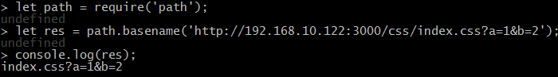

@(node.js)[javascript, node.js, 服务器]

# Node.js-04-http、url、querystring模块

### http模块
> 开启服务，持续监听，对客户端的请求做出响应。

- 语法
	- 基本语法1
	- `request.url`获取请求地址
	- `request.method`获取请求方式
	- `resquest.on('data',(chunk)=>{})`,`request.on(end,()=>{})`获取`post`数据

		```
		//依赖http模块
		const http = require('http');
		//创建服务
		//request为客户端请求的数据  
		//response为服务器响应给客户端的数据
		http.createServer((request, response) => {
		//响应，返回数据
			response.write('hello world');
			response.write('Hi');
			//响应结束
			response.end();//该方法必须有，告诉客户端响应结束。
		 })
		//指定端口，ip地址，及成功请求后的callback
		.listen(3000,'192.168.15.103',() => {
			console.log('running')
		});
		```

	- 语法2

		```
		let server = http.createServer();
		server.on('request', (request,response) => {
			response.end('hello world');
		})
		server.listen(3000,'192.168.15.103',() =>{
			console.log('running');
		})
		```

- 使用到的API
	- `path.basename(str)`
		- 获取最后一个`/`后的的字符串，包含参数、锚点

	- `path.extname(fileDir)`
		- 获取文件的后缀名
	- `str.startsWith(str2);`
	- `str.endsWith(str3);`
	- `url.parse(urlStr,true);`带上true参数，将得带的对象的`query`属性变为一个对象，默认为字符串
	- `url.format(urlObj);`
	```
	//依赖url核心模块
	const url = require('url');
	//假设某url为一下字符串
	let str = 'http://www.baidu.com:8080/main/len/index.html?a=1&b=2';
	//通过url.parse()将url字符串转换为url对象
	let urlObj = url.parse(str,true)
	console.log(urlObj);//urlObj就是下部 o 的形式
	//通过点语法可以直接获取url地址传递的每一个参数
	console.log(urlObj.query.a)
	let o  = {
		protocol: 'http:',
		slashes: true,
		auth: null,
		host: 'www.baidu.com:8080',
		port: '8080',
		hostname: 'www.baidu.com',
		hash: null,
		search: '?a=1&b=2',
		query: { a: '1', b: '2' },
		pathname: '/main/len/index.html',
		path: '/main/len/index.html?a=1&b=2',
		href: 'http://www.baidu.com:8080/main/len/index.html?a=1&b=2' 
	};
	//通过url.format()方法可以将urlObj形式的对象再转换为url地址的形式
	let str2 = url.format(o);
	console.log(str2);
	```


- 实现静态网站服务器的功能
	- MIME
		- MIME(Multipurpose Internet Mail Extensions)多用途互联网邮件扩展类型。是设定某种扩展名的文件用一种应用程序来打开的方式类型，当该扩展名文件被访问的时候，浏览器会自动使用指定应用程序来打开。多用于指定一些客户端自定义的文件名，以及一些媒体文件打开方式。
		- 我们需要在响应头中告诉浏览器，应该以何种方式解析响应的各类格式的文件。是以纯文本的形式解析还是以html或是js的形式解析？如：html `text/html`；纯文本 `text/plain`...
		- 详细百度

			
			const http = require('http');
			const path = require('path');
			const fs = require('fs');
			
			//一个专门用于存放MIME信息的json文件，需要响应文件时，直接在里面找以何种形式响应即可
			//内容大致为
			//{".avi": "video/x-msvideo",".js": "application/x-javascript",".jpeg": "image/jpeg",".htm": "text/html",".css": "text/css"}等
			const mime = require('./mime.json');
			
			//设置一个存放静态资源的文件夹
			let staticDir = 'static';
			//request 是 Class: http.IncomingMessage 的实例
			//response 是 Class: http.ServerResponse 的实例
			http.createServer((request, response) => {
				//
			    let fileName = path.basename(request.url);
			    let fileDir = path.join(__dirname, staticDir, fileName);
			    //如果url地址（这里的地址指的是端口之后的部分）以www开头
			    if (request.url.startsWith('/www')) {
			    //那么就返回static文件夹下的相应的文件
					//如果请求地址为http://ip:port/www/index.html的话，就返回static文件夹下index.html的文件
					//返回什么文件与前端指向的url并无关系，后台可进行判断，返回任意数据。
					//这里为了说明前端请求的地址并不一定就是文件的真是路径，故在此使用不同的路径。
			        fs.readFile(fileDir, 'utf8', (err, data) => {
				        //获取文件的后缀名
			        	let ext = path.extname(fileDir);
			        	
			        	//如果存在，那么用cType储存
			        	if(mime[ext]){
			        		cType = mime[ext];
				        	//如果是文本文件才需要指定编码
				        	if(mime[ext].startsWith('text')){
				        		cType += ';charset=utf8';//此时cType的形式就是：'text/html;charset=utf8;'
				        	}
			        	}
			        	//设置响应头信息
			        	//状态码参数 状态码num，信息obj
			        	response.writeHead(200,{
			        		//设置响应数据的格式为html，编码格式为utf8，若不设置会出现乱码或其他bug
			        		//text/html 具体哪种格式文件使用哪种响应类型，查询MIME协议
			        		// 'Content-Type':'text/html;charset=utf8'
			        		//格式为纯文本
			        		// 'Content-Type':'text/plain;charset=utf8'
			        		//自动匹配文件类型
			        		'Content-Type':cType
			
			        	});
			        	response.end(data);
			        })
			    }
			}).listen(3000, '192.168.15.103', () => {
			    console.log('begining...');
			});


- `get`
	- 获取`get`请求的参数，并响应。
	- 本质上`get`请求就是就是在url后添加参数。
	- 通过`url.parse()`来将`get`的参数转换为对象，进行判断，并执行响应的后台逻辑。

- `post`
	- `post`无法通过url地址直接获取，且可能数据量较大，通过一下方法获取。
	- `const querystring = require('querystring');`用于处理post获得的参数

		```
		<!-- form表单通过post提交数据 -->
		<form action="/check" method="post">
			用户名：<input type="text" name="un">
			密码：<input type="password" name="pw">
			<input type="submit" value="登录">
		</form>	
		```

		```
		//common.js
		//对获取静态资源的初始化代码进行了封装，就是抽取了上部实现静态网站功能服务器的代码。
		const path = require('path');
		const fs = require('fs');
		const mime = require('./mime.json');
		
		exports.staticInit = (req,res,staticDir) => {
		    let fileName = path.basename(req.url);
		    let fileDir = path.join(__dirname, staticDir, fileName);
		    fs.readFile(fileDir, 'utf8', (err, data) => {
		        let ext = path.extname(fileDir);
		        if (mime[ext]) {
		            let cType = mime[ext];
		            if (mime[ext].startsWith('text')) {
		                cType += ';charset=utf8;';
		            }
		            res.writeHead(200, {
		                'Content-Type': cType
		            });
		        }
		        res.end(data);
		    });
		}
		```

		```
		const http = require('http');
		const initObj = require('./common.js');
		//用于处理 'a=1&b=2&c=3' 这类字符串，转换为对象
		//querystring.parse(str);
		const querystring = require('querystring');
		let staticDir = './static/';
		http.createServer((req, res) => {
			//初始化静态资源服务器
		    initObj.staticInit(req, res, staticDir);
		    if (req.url.startsWith('/check')) {
			    //设置一个字符串，用于接收post数据
		        let postData = '';
		        //类似于大文件的复制，流式传输
		        req.on('data', (chunk) => {
			        //拼接request的每段数据
		            postData += chunk;
		        });
		        req.on('end', () => {
			        //将接收到的字符串转换为对象
		            let postObj = querystring.parse(postData);
		            //判断登录信息是否符合，并返回数据
		            if (postObj.un === 'admin' && postObj.pw === '123') {
		                res.end('登录成功');
		            } else {
		                res.end('帐号或密码错误');
		            }
		        })
		    }
		}).listen(3000, () => {
		    console.log('runing...');
		});
		```

